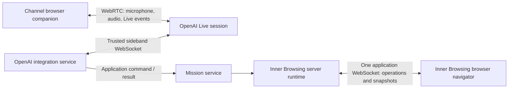

# Starship Docking — learning Inner Browsing with GPT-Live

A human pilot and a voice copilot share one Starship. The human sets rotation and
aligns the ship; the robot inspects, measures the station, applies thrust, brakes,
and attempts docking. Inner Browsing composes the running application.

This is the refactored demo. The original, including its repository and local
configuration, is preserved in `../demo-gpt-live-startship-docking_legacy/`.
The new directory corrects the original `startship` spelling to `starship`.

## Run

Use Node **22.6 or newer** (the OpenAI SDK requires Node 22):

```sh
nvm use
npm install
# Only if config.json does not already exist:
cp -n config.example.json config.json
npm start
```

Set `openaiApiKey` in the ignored `config.json`, or set `OPENAI_API_KEY` in your
shell. Existing local configuration was copied during this refactor. Never put a
key in browser code. Open `http://localhost:3000`, start a mission, and allow the
microphone. The configured models remain `gpt-live-1` and `gpt-5.6-terra`.

The server binds to loopback by default. This remains a local demonstration:
actor checks teach application permissions, and the server owns the mission state.
The browser is a renderer and human input surface. A disconnected tab ends its
mission; reload starts with a new runtime. There is no resume/replay of a previous mission.

## Start with the application tree

These are real canonical applets, with server and browser companions. The logical runtime tree is:

```text
app                                      Start / End mission
└── mission                             Lifetime of one mission
    ├── channel                          Voice, media and session operations
    ├── starship                         Human commands and robot readouts
    ├── environment                      Mission clock and terminal state
    └── world                             Three.js rendering
```

On disk, each applet separates its own companions from its children. The two
connection-scoped application services live at `src/`, because the main server
constructs them before it assembles the Inner Browsing runtime:

```text
src/
├── serviceMission.js             application mission service
├── serviceGptLive.js             OpenAI Live connection service
├── serviceGptLiveSession.js      Live and Responses session configuration
└── applets/app/
├── index.js                      applet definition
├── client/
├── server/
└── child/mission/
    ├── index.js
    ├── client/
    ├── server/
    │   └── index.js              lifecycle and operations adapter
    └── child/
        ├── channel/
        │   ├── index.js
        │   ├── client/           WebRTC and voice UI
        │   └── server/
        │       └── index.js      channel operations adapter
        ├── starship/
        │   ├── index.js
        │   ├── client/           pilot console and robot readouts
        │   └── server/
        │       └── index.js      Domain, lifecycle, and operations
        ├── environment/
        │   ├── index.js          applet definition
        │   ├── client/           renders the server state
        │   └── server/
        │       └── index.js      Domain, lifecycle, and operations
        └── 3dworld/              index.js, client/, server/
```

`child/` is a filesystem convention, not an extra applet. Each applet’s root `index.js` maps
logical identity `app/mission/world` to directory
`app/child/mission/child/3dworld`. Runtime operations and
parent/anchor relationships continue to use the logical names.

[The registry](src/appletRegistry.js) assembles the definitions exported by each
applet’s root `index.js` and checks their browser files. Each definition owns its
logical path, accepted child anchors, companion loading and service injection. The
runtime assembly in [server.mjs](server.mjs) creates a separate registry, state store
and runtime for each browser connection.
It uses the framework's own state-tree store in a disposable temporary directory.
No application singleton shares commands between tabs.

There is no separate `domain/` or `integrations/` directory. Game rules live with
their owning applet: Starship in `starship/server/index.js`, environment rules
in Environment's `server/index.js`; mission coordination lives in `src/serviceMission.js`;
OpenAI integration lives in `src/serviceGptLive.js`.
The server assembles the connection-scoped runtime and injects its Mission service.
It constructs the Channel provider once per connection, so tests can still
substitute it without calling OpenAI.

The main server constructs Mission and OpenAILiveService once per browser connection.
Applet server entry points receive these services through registry injection and
adapt lifecycle and operation calls. Session instructions and tool schemas live
in `src/serviceGptLiveSession.js`.

The Starship browser companion imports the command table from
`starship/server/index.js`. Environment and World render the state snapshots
published by the server. Only that dependency-free command entry point and the
browser companions are served publicly; root definitions and server providers remain private.


`Start mission` loads the Mission subtree. Each browser companion materializes
through Inner Browsing's navigator. Channel connects asynchronously, so microphone
or SDP work does not block the other applets from mounting. The countdown starts
when Channel reports `Ready`. `End mission`, channel closure, or browser transport
closure disposes the subtree. Winning or failing updates the server state and the
browser renders the final cockpit until the conversation ends.

The Environment and Starship server companions own the simulation state and rules.
Their browser companions render snapshots and send human commands. The 3D World
does not decide speed, alignment, approach, or docking.

## Zones of responsibility

| Zone | Read here | Owns |
| --- | --- | --- |
| HTTP and runtime transport | [server.mjs](server.mjs) | Static browser assets, origin check, one WebSocket adapter, connection lifetime |
| Framework composition | [src/appletRegistry.js](src/appletRegistry.js), [server.mjs](server.mjs) | Applet definitions, injected services, native load/update/destroy |
| Application business flow | [Mission service](src/serviceMission.js) | Mission scope, authoritative services, actor validation, task history, and state publication |
| Ship business rules | [Starship server](src/applets/app/child/mission/child/starship/server/index.js) | Shared capability table, energy costs, rotation, approach, braking, alignment, docking conditions |
| Environment rules | [Environment server](src/applets/app/child/mission/child/environment/server/index.js) | Clock, running/won/failed/stopped transitions, terminal conditions |
| Main OpenAI channel | [Channel client](src/applets/app/child/mission/child/channel/client/index.js), [LiveClient](src/applets/app/child/mission/child/channel/client/live-client.js) | Microphone, WebRTC, data-channel events, captions, audio, reference context |
| OpenAI server integration | [Channel server](src/applets/app/child/mission/child/channel/server/index.js), [provider](src/serviceGptLive.js), [session](src/serviceGptLiveSession.js) | Connection operations, Live creation, sideband, Responses tools, OpenAI envelopes and call correlation |
| Human and robot controls | [Starship client](src/applets/app/child/mission/child/starship/client/index.js), [server](src/applets/app/child/mission/child/starship/server/index.js) | Human input operations, availability feedback, and state rendering |
| Browser environment | [Environment client](src/applets/app/child/mission/child/environment/client/index.js) | Renders the server-owned clock, phase, and energy snapshot |
| 3D world | [World companion](src/applets/app/child/mission/child/3dworld/client/index.js), [renderer](src/applets/app/child/mission/child/3dworld/client/world.js) | Camera, station, guide, stars, black hole, resize and GPU cleanup |

The Mission service creates one Environment service and one Starship service for
each browser connection. The applet server companions expose those same objects,
so the ownership and validation boundary is visible without extra indirection.
They contain no OpenAI or browser imports. World renders ship snapshots and never
decides whether docking succeeded.

## The three connections



**Main channel:** `LiveClient` obtains media, creates an SDP offer and calls the
Channel's `Connect` applet operation. The server integration creates the Live
session and returns its SDP answer through that same operation. Browser audio
goes directly to OpenAI; Node does not proxy it. HTTP WebRTC creation starts the
session, so neither connection sends `session.start` again.

**Sideband:** the server attaches `SidebandWS` to the returned Live session.
Nested `response.output_item.done` function calls are translated from OpenAI tool
names into ordinary application commands. Deduplication and `call_id` stay here.
The handler closure keeps each external call associated with its eventual
application result. This demo does not need a separate response/delegation index
because each awaited result stays in that call's handler and continuation uses
the attached session. Destroying a session invalidates its outstanding handlers.

**Application connection:** `/runtime` adapts the transport-neutral Inner Browsing
protocol to the existing `ws` dependency. It carries `applet.operation`, operation
replies and native `navigator.snapshot` envelopes. There is no second browser
command bridge, `/api/session` endpoint, or browser `<tool>.request` protocol.
The browser never sends OpenAI tool-call IDs back to Node.

OpenAI-specific event decoding in Channel is limited to communication UI such as
captions and session status. Application command execution lives elsewhere.

The integration preserves the official [Live delegation and tools](https://developers.openai.com/api/docs/guides/live-delegation)
flow: execute the application capability, return `function_call_output` with
`response.item.create`, then continue using `response.create`. Sending an output
is not proof of spoken acknowledgement from the model.

## Follow one robot command

Suppose the pilot says “measure the station's rotation.”

1. OpenAI delegates a function call to the server sideband.
2. The integration maps `analyze_rotation_speed` to `analyzeRotationSpeed` and
   invokes the Mission service with the fixed actor `model`.
3. Mission reads the authoritative Starship service, records the completed task,
   and publishes the new applet state.
4. Inner Browsing sends the snapshot to the browser. Controls, Environment, and
   World render the returned state; none of them calculates the result.
5. The integration sends the application result to OpenAI and continues the
   conversation.

No OpenAI `call_id`, `response_id`, `delegation_id`, or function-call envelope
crosses into Starship or Environment. The task list keeps the most recent 20
application results; the browser receives state snapshots after each change.

## Follow one human command

The rotation form sends `Human command` to Starship. Its server operations
companion fixes the actor to `user`, validates the command, updates the Starship
service, and publishes the resulting state. A request cannot become a robot
command by supplying its own `actor` field.

| Actor | Capabilities | Energy |
| --- | --- | --- |
| Human (`user`) | Set rotation, begin alignment, nudge X/Y | 4, 2, 1 |
| Robot (`model`) | Inspect, measure rotation, thrust, brake, dock | 0, 6, 3, 2, 12 |

The table is defined in `src/applets/app/child/mission/child/starship/server/index.js`; the UI displays costs from it.
Inspect is read-only and remains available after gameplay wins or fails, while the
mission subtree is still open. Other actions require a running mission and
sufficient energy.

Docking still requires matched rotation, the guide within the port, distance
between -0.3 and 0.3, and velocity no greater than 0.15. An allowed attempt costs
energy even when it misses. Thrust persists until braking; unsafe
contact, time expiry or exhausted energy fails the mission.

## Retained state and browser rendering

Retained applet state contains mission identity/phase, Channel status, and the
bounded task history. Tasks record application results; they are not a disguise
for every incoming Live event.

There are **no projections** here. Inner Browsing projections represent separately
identified, placed applet instances. A tool call or transcript delta is not such
an instance. The 3D “view” is a canonical child applet, not a framework projection.

The server retains the Environment and Starship domains. Browser applets render
the latest state delivered through Inner Browsing updates. World may interpolate
that snapshot between updates for smooth rotation and approach motion, but it is
visual only; it does not own physics, telemetry, commands, or docking decisions.

## Lifecycle and failure handling

- Mission teardown closes the sideband and destroys all descendant applets.
  OpenAI deduplication applies for the lifetime of its session.
- Browser cleanup stops media tracks, closes the peer/data channel, cancels
  startup/ICE timers, stops the radio, disconnects resize observation, and
  disposes Three.js geometry/materials/textures.
- The runtime operation queue carries state snapshots and direct application
  operations; there is no browser task completion loop.
- Framework lifecycle callbacks do not await another composer mutation from
  inside its mutation queue. Game destruction performs synchronous service cleanup.
- Runtime disconnection destroys browser applets. A reload creates a new mission;
  it does not replay old ship commands or reattach to an old OpenAI session.

## Framework provenance and learning path

`vendor/inner-browsing` is an unchanged copy of the complete package from
`labs-pattern-appcomposer-020-inner-browsing/packages/inner-browsing`, referenced
as a local npm dependency. It includes its original license, source and tests;
there is no forked runtime implementation. This makes the demo installable
without a dependency on an absolute path to the meetings workspace. See
[vendor/README.md](vendor/README.md) for provenance.

The Meetingbro example informed service injection and the separation of applet
operations from business services. The smaller demo does not need its projection
coordinator, mediator catalog or durable business repositories.

A useful reading order is: registry → applet root definitions → Mission service
→ Starship operations → Environment client → World → Channel
and the GPT Live service. Finally read the
small [browser bootstrap](public/bootstrap.js), whose job is just transport and
framework reconciliation. There is no replacement monolithic browser `app.js`.

## Verification

```sh
npm test
node --test vendor/inner-browsing/test/*.test.js
```

The six focused tests cover actual applet load/destroy, actor and argument
validation, direct robot reads, authoritative domain measurement/docking, mission
isolation, and teardown. The integration tests cover OpenAI result-before-continuation.
The vendored framework suite also passes.

The browser smoke test exercises real Chromium, DOM, WebGL, WebSocket transport
and Inner Browsing, with only WebRTC and the external Live service mocked:

```sh
node test/browser-fixture.mjs
# In another terminal, launch your Chromium binary:
chromium --headless --remote-debugging-port=9337 \
  --user-data-dir=/tmp/starship-browser-profile about:blank
# Then:
node test/browser-smoke.mjs
```

It verifies robot measurement/inspection, human speed/alignment/nudges, mobile
width, resource teardown, a second mission, denied microphone access and ending during microphone acquisition. It saves screenshots in `/tmp`.
The fixture never loads `config.json` or sends an OpenAI request.

A real microphone/OpenAI call has **not** been verified in this refactor. To check
it manually, start the normal server, ask for measured rotation, enter that value,
align, request thrust/braking, then attempt docking. Also test denied microphone
access and End during connection startup.

The Mission service advances simulation every 50 ms while running and publishes
state through Inner Browsing. The 3D renderer uses animation frames to smooth
those updates, with prediction capped at 150 ms if delivery stalls. Robot tools
read the server domains directly; no frame or geometry supplies game facts.

The left Channel console displays the transcript and last robot command in inset
terminals. Mission sends the command result through Channel state; Starship still
owns the command logic and human controls. Channel event logging has no UI panel.
