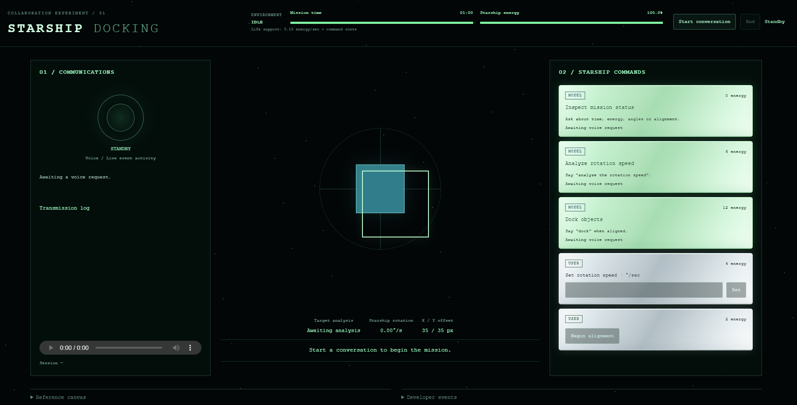

# GPT-Live: Collaborating with Voice and the Starship Docking Scene



A small teaching demo for exploring GPT-Live over WebRTC. A human pilot and a voice copilot share one browser-owned Starship:

- the pilot sets rotation speed and aligns the ship by hand;
- the copilot can inspect mission status, analyze the target, and request docking;
- the browser owns the actual animation, energy, time, and geometry;
- a failed docking attempt spends energy and time, but can be retried;
- GPT-Live receives the browser result and explains it by voice.

This is a local learning prototype, not a production architecture.

## Run locally

Use Node.js 22.6 or later:

```bash
nvm install
nvm use
npm install
cp -n config.example.json config.json
```

Edit `config.json` and set `openaiApiKey`, then run:

```bash
npm start
```

Open [http://localhost:3000](http://localhost:3000) in Chrome and click **Start conversation**. The API key remains server-side and `config.json` is ignored by Git.

## Fly the mission

1. Start the conversation and grant microphone access. The 60-second mission begins immediately.
2. Say **“Analyze the rotation speed.”**
3. Enter the reported value in **Set rotation speed**.
4. Click **Begin alignment** and use the controls or arrow keys to align X/Y.
5. Ask **“How much time and energy remain?”**, **“What is our angle?”**, or **“Are we aligned?”**.
6. Ask **“Dock.”** A docking attempt is allowed at any time while the mission is active and energy remains, even if alignment is incomplete.
7. A miss costs 12 energy and takes time. The ship returns to its approach size so you can try again.
8. Time expiration or zero energy ends the mission. Live is instructed to say, “See you on the other side.”

## Responsibility zones

The interface makes the zones visible: communication on the left, the Starship scene in the center, and commands/environment on the right.

| Zone | Responsibility |
| --- | --- |
| **GPT-Live** | Listens, speaks, interprets the pilot, and decides when delegated work is needed. |
| **Responses** | Receives delegated work, selects `inspect_starship`, `analyze_rotation_speed`, or `dock_objects`, and interprets the returned result. |
| **Node server** | Keeps the API key private, creates the Live WebRTC session, attaches the trusted sideband, routes delegated calls, and returns browser results to Responses. |
| **Starship** | Owns commands, actor permissions, energy, speed, angles, position, and docking checks. |
| **Environment** | Owns elapsed mission time and decides what energy depletion, time expiration, or successful docking means for the mission. |
| **Browser UI** | Renders the scene, sends user commands to Starship, displays gauges, and carries the WebRTC audio/events connection. |

The important domain rule is:

```text
Starship owns its energy and actions.
Environment owns the conditions under which those actions can continue.
```

User commands run directly in the browser:

```text
USER → Starship.setRotationSpeed(value)
USER → Starship.beginAlignment()
USER → Starship.nudge(x, y)
```

Model commands use the Responses delegation path:

```text
GPT-Live → Responses → Node sideband → browser → Starship
                                      ↑
                       result / measurements
                                      │
GPT-Live ← Responses ← Node: response.item.create + response.create
```

The actor value (`"user"` or `"model"`) expresses the teaching boundary in code. It is not an authentication system.

## Is Node still necessary?

Yes, for this version, but Node does not carry the live audio conversation.

The direct audio path is:

```text
Browser microphone ⇄ WebRTC ⇄ GPT-Live audio
Browser oai-events ⇄ WebRTC data channel ⇄ GPT-Live events
```

Node is still used for two specific reasons:

1. **Session bootstrap and secret protection.** The browser sends its SDP offer to `POST /api/session`; Node calls `client.live.create` with the project key and returns the SDP answer. The key never enters browser code.
2. **Responses delegation coordination.** The current design deliberately uses a server-owned Responses backend. Node attaches `SidebandWS`, receives the delegated function call, sends a local request over `/ws` to the browser, and sends the browser’s verified result back with `response.item.create` followed by `response.create`.

Node does not approve every mouse movement, speed entry, or alignment nudge. Those are deterministic Starship operations in the browser. Node handles delegated operation requests and results; ordinary client context goes directly over the Live data channel.

## Could Node be reduced further?

Yes, if the delegation mode changes.

With **client delegation**, GPT-Live can emit application delegation events to the browser, and the browser can perform Starship commands directly through the `oai-events` channel. That could remove the Node `/ws` bridge and the Node sideband for the model commands. A server endpoint would still normally be needed to create the WebRTC session without exposing the project key, unless the application uses another server-issued credential flow.

This project keeps the Node sideband because it demonstrates a different lesson: GPT-Live remains the conversational model while Responses performs delegated backend work and waits for a browser result. Removing that path would make the app smaller, but it would change the delegation experiment.

## Commands and costs

| Command | Actor | Cost |
| --- | --- | ---: |
| `Starship.inspect("model")` | MODEL | 0 |
| `Starship.analyzeRotationSpeed("model")` | MODEL | 6 |
| `Starship.dock("model")` | MODEL | 12 |
| `Starship.setRotationSpeed(value, "user")` | USER | 4 |
| `Starship.beginAlignment("user")` | USER | 2 |
| `Starship.nudge(x, y, "user")` | USER | 1 |

The Starship also consumes 0.15 energy per second. Costs are defined once in `src/starship.js` and displayed by the UI from that same table. Rejected commands do not spend command energy.

## Testing the mission

Testing this prototype means running the mission manually in Chrome, speaking to GPT-Live, watching the scene, and reading the event and transcript areas. The purpose is to observe how the two responsibility zones cooperate while the browser remains the authority for the game state.

### The mission test

Start the conversation and grant microphone access. The mission clock begins immediately. Then exercise the complete path:

1. Ask GPT-Live to analyze the rotation speed.
2. Listen for the measured value and enter it in the user speed form.
3. Begin alignment and move the outline ship by hand until the center offset is within the tolerance.
4. Ask for current time, energy, angle, or alignment when you want to inspect the live state.
5. Ask GPT-Live to dock, including before alignment if you want to observe a failed attempt.
6. Observe that a docking attempt consumes energy and time. A miss returns the ship to approach size and leaves the mission available for another attempt.
7. Complete a successful dock, or let time and energy run out to observe the terminal path.

### What the user can do

The user is the pilot. The user can set the rotation speed, begin alignment, nudge the ship in X/Y, inspect the visible gauges, and choose when to ask for docking. These commands happen in the browser and are checked by the Starship object.

The user cannot directly execute the model-owned analysis or docking tool panels. The command cards label this difference with `USER` and `MODEL`, making the actor boundary visible during the test.

### What the model can do

GPT-Live is the voice copilot. It can ask Responses to inspect the current Starship and Environment state, measure the target rotation, or attempt docking. It can explain results and suggest the next action.

The model cannot set the user's speed form or move the ship's alignment. It also should not claim a speed, alignment, docking success, remaining energy, or remaining time until it receives a current browser result. A failed dock is a resource-consuming attempt rather than automatically a mission failure.

### Transcript area and an unexpected audio observation

The left communication panel contains the transcript area. It displays input transcript deltas from the microphone and output transcript deltas from GPT-Live, along with the activity indicator above it. The transcript is useful evidence during testing, while the event log shows the lower-level Live, delegation, and bridge events.


During exploratory testing, an unexpected burp was picked up by the microphone. The transcript shows the practical behavior clearly: GPT-Live hears the microphone stream, attempts to transcribe whatever audio crosses the input, and may interpret an accidental sound as speech or as a conversational cue. The model is not receiving a clean semantic text command from the user; it is receiving live audio that can include breathing, room noise, laughter, a burp, or other incidental sounds.

That observation is useful for this prototype. It shows why the transcript should be treated as an observation of the audio interaction rather than a perfect record of user intent. It also shows why the model may respond to something the user did not intend as a command. Repeat the test with a deliberate phrase after the unexpected sound and compare the transcript, event log, and spoken response.

The screenshot is referenced by the filename `doc_unexpected_image.png` at the project root. Add that image before publishing the repository if it is not already present.

## Files

```text
server.mjs             Live session, tools, API key, sideband and /ws bridge
src/environment.js     Mission clock and terminal conditions
src/starship.js        Commands, actors, costs, energy and geometry
src/live-client.js     WebRTC bootstrap, audio, data channel and browser bridge
src/app.js             Connects domain events, transport and UI
src/index.html         Communications, scene and command console
src/styles.css         Star field and spacecraft visual system
config.example.json    Safe configuration template
config.json            Local secret configuration; ignored by Git
```

## Protocol details

HTTP WebRTC creation starts the Live session. The browser waits for `session.started` and sends no additional `session.start`. When ending, it sends `session.close` and waits for `session.closed`.

The reference canvas uses `session.thinking.append` for silent context. Selected state changes use `session.commentary.append` when Live may explain them aloud. Commentary acceptance does not guarantee exact wording or audio playback.

For delegated tool completion, `response.item.create` adds the `function_call_output`; `response.create` then continues the delegated Responses work. A local browser acknowledgement means Node sent those events. It does not guarantee that Responses accepted them or that GPT-Live has already spoken.

These choices follow the [OpenAI Live API reference](https://developers.openai.com/api/reference/typescript/resources/live), the [GPT-Live delegation guide](https://developers.openai.com/api/docs/guides/live-delegation), and the [WebRTC guide](https://developers.openai.com/api/docs/guides/voice-webrtc?api=live).

## Publishing later

No Git repository was initialized and no commit or push was made during this cleanup. When ready, review the staged files and use:

```bash
git init
git add .
git diff --cached --stat
git commit -m "Initial GPT-Live docking demo"
git branch -M main
git remote add origin git@github.com:taboca/labs-collaboration-gptlive-docking.git
git push -u origin main
```
